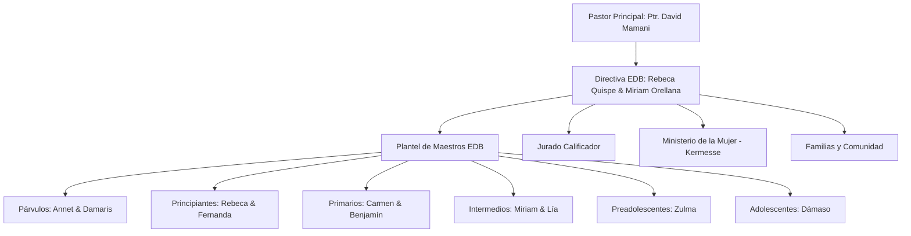

# 📘 PLAN DE IMPLEMENTACIÓN Y PROPUESTA INTEGRAL
## “LA BIBLIA EN ACCIÓN” – FERIA DEL MES DE LA BIBLIA
### Escuela Dominical de Niños (EDB) — Iglesia Asambleas de Dios Olivos

---

## 1. RESUMEN EJECUTIVO Y DATOS GENERALES

El presente documento define la planificación pedagógica, logística, visual y tecnológica para la realización del evento **“La Biblia en Acción – Feria del Mes de la Biblia”** y el desarrollo de su **página web oficial interactiva**.

El proyecto integra el trabajo de las seis clases de la Escuela Dominical, el respaldo pastoral, el apoyo del Ministerio de la Mujer y la participación activa de los padres de familia, articulados a través de una identidad visual unificada de estilo *kawaii* cristiano, protagonizada por la mascota oficial: un simpático pingüino con chaleco guinda.

| Parámetro | Detalle |
| :--- | :--- |
| **Nombre del Evento** | La Biblia en Acción – Feria del Mes de la Biblia |
| **Lema Oficial** | *"Aprender, participar y compartir"* |
| **Fecha Central** | Domingo 27 de octubre |
| **Lugar** | Iglesia Asambleas de Dios Olivos |
| **Población Beneficiaria** | Párvulos, Principiantes, Primarios, Intermedios, Preadolescentes, Adolescentes/Jóvenes, Padres de Familia y Congregación |
| **Organización** | Directiva y Plantel Docente de la Escuela Dominical (EDB) |
| **Pastor encargado** | Ptr. David Mamani |
| **Directiva EDB** | Rebeca Quispe & Miriam Orellana |
| **Contacto de Coordinación** | Rebeca Quispe — Cel. 75855943 |
| **Meta de Cooperación** | Recaudación de fondos para la adquisición de una **Impresora Multifuncional Propia para la EDB** |
| **Modalidad del Evento** | Circuito de estaciones bíblicas interactivas + Evaluación de Jurado + Mini Kermesse y Zona de Ventas |
| **Recursos Visuales** | Colección oficial de 13 ilustraciones originales estilo *kawaii* pastel |
| **Plataforma Web** | Sitio web estático, responsivo, interactivo (HTML5, CSS3 Vanilla, JavaScript Moderno) |

---

## 2. JUSTIFICACIÓN Y OBJETIVOS

### 2.1. Justificación
La enseñanza bíblica para las nuevas generaciones demanda métodos dinámicos, vivenciales y participativos. La Feria "La Biblia en Acción" surge como una respuesta pedagógica y espiritual para:
1. **Fomentar el amor y la reverencia por la Palabra de Dios** en los niños desde sus primeros años hasta la juventud.
2. **Promover el protagonismo de los estudiantes**, permitiéndoles investigar, armar maquetas, preparar dramatizaciones y explicar ellos mismos las verdades bíblicas a la congregación.
3. **Fortalecer la unidad comunitaria e interministerial**, sumando el apoyo del Ministerio de la Mujer en la gastronomía y la integración de las familias como soporte espiritual y formativo.
4. **Alcanzar una meta logística prioritaria**: la compra de una impresora propia que optimice la producción de material didáctico, fichas de estudio y manualidades para las clases dominicales durante todo el año.

### 2.2. Objetivos del Evento
- **Objetivo Espiritual:** Conectar a cada niño y adolescente con verdades bíblicas prácticas que afiancen su fe en Cristo y su testimonio diario.
- **Objetivo Educativo:** Desarrollar habilidades de exposición, trabajo en equipo, creatividad plástica y comprensión lectora de las Sagradas Escrituras.
- **Objetivo Institucional:** Generar fondos para la autosuficiencia operativa de la Escuela Dominical a través de la mini kermesse y donaciones voluntarias.

### 2.3. Objetivos de la Plataforma Web
- Servir como vitrina pública oficial para comunicar el programa, las estaciones, los horarios y las actividades.
- Brindar a los padres de familia y miembros de la iglesia acceso transparente a la meta de recaudación y formas de colaborar.
- Presentar de forma atractiva la galería ilustrada de cada curso, motivando la asistencia de toda la congregación.

---

## 3. EQUIPO DE LIDERAZGO Y RESPONSABILIDADES



### 3.1. Directorio del Proyecto
- **Liderazgo Pastoral:** Ptr. David Mamani (Supervisión espiritual y evaluación).
- **Directiva de Escuela Dominical:**
  - Rebeca Quispe (Coordinación general, enlace de aportes y logística).
  - Miriam Orellana (Coordinación pedagógica y apoyo de actividades).
- **Plantel Docente por Cursos:**
  - *Párvulos (3-5 años):* Annet & Damaris.
  - *Principiantes (6-7 años):* Rebeca & Fernanda.
  - *Primarios (8-9 años):* Carmen & Benjamín.
  - *Intermedios (10-11 años):* Miriam & Lía.
  - *Preadolescentes (12-14 años):* Zulma.
  - *Adolescentes y Jóvenes (15-18 años):* Dámaso.
- **Ministerio de la Mujer:** Coordinación culinaria, elaboración de platos principales y atención de la cocina solidaria.
- **Comité de Evaluación (Jurado):** Pastores, líderes de ministerios y maestros invitados.

---

## 4. CRONOGRAMA DE PREPARACIÓN Y EJECUCIÓN

| Fecha | Fase | Actividades Principales | Responsables |
| :--- | :--- | :--- | :--- |
| **Domingo 13 de Septiembre** | **Fase 1: Fundamentación y Diseño** | - Asignación formal de temas bíblicos por clase.<br>- Planificación pedagógica de objetivos y versículos a memorizar.<br>- Definición de dinámicas, juegos y maquetas a construir. | Directiva, Maestros y Estudiantes |
| **Domingo 20 de Septiembre** | **Fase 2: Taller de Producción** | - Elaboración de materiales visuales, paneles y maquetas en relieve.<br>- Práctica de exposiciones y memorización de versículos.<br>- Coordinación de insumos para la kermesse con el Ministerio de la Mujer. | Maestros, Estudiantes y Padres de Familia |
| **Domingo 27 de Octubre** | **Fase 3: Día Central de la Feria** | - Montaje de estaciones bíblicas y stands temáticos.<br>- Apertura de la Feria y bienvenida a cargo del Ptr. David Mamani.<br>- Recorrido de los cursos, dinámicas y presentación ante el Jurado.<br>- Apertura de la Mini Kermesse y zona de ventas.<br>- Conteo de votos, premiación y balance de la meta para la impresora. | Toda la comunidad EDB, Pastores y Familias |

---

## 5. CATÁLOGO OFICIAL DE IMÁGENES Y ASIGNACIÓN POR SECCIÓN

El proyecto cuenta con **13 ilustraciones oficiales** elaboradas en un estilo artístico coherente (*kawaii*, paleta pastel, iluminación cálida, fondos suaves y presencia del pingüino embajador de la EDB).

| # | Archivo de Imagen | Sección Asignada en la Web / Evento | Descripción Visual y Significado |
| :-: | :--- | :--- | :--- |
| **01** | `IMAGES/PORTADA — LA BIBLIA EN ACCIÓN.png` | **Hero / Portada Principal** | El pingüino central con chaleco guinda rodeado de niños entusiasmados, carpas de feria, guirnaldas multicolores y tarjetas ilustradas de Jesús y relatos bíblicos. Representa la alegría de la celebración congregacional. |
| **02** | `IMAGES/TODOS SOMOS PARTE DE LA FERIA.png` | **Bienvenida y Justificación** | El pingüino saludando en una mesa de dibujo interactiva junto a niños coloreando flores y soles. Simboliza la integración, la acogida a los nuevos niños y el valor de pertenecer a la familia de Dios. |
| **03** | `IMAGES/FERIA POR ESTACIONES.png` | **Encabezado de Estaciones Bíblicas** | El pingüino orientando a niños en una estación lúdica con tarjetas de adivinanzas con signos de interrogación y estrellas. Marca la transición a la sección interactiva de los cursos. |
| **04** | `IMAGES/PARVULOS.png` | **Estación 1: Párvulos (3 a 5 años)** | Niños pequeños sobre alfombra junto al pingüino descubriendo láminas de animales (leoncito) y figuras de la naturaleza (árbol, pez, sol, flores). Enfatiza a Dios como Creador amoroso y proveedor. |
| **05** | `IMAGES/PRINCIPIANTES.png` | **Estación 2: Principiantes (6 a 7 años)** | Estudiantes levantando la mano felices participando activamente, mientras el pingüino expone láminas con rollos antiguos, la Santa Biblia y mapas bíblicos. Representa la curiosidad por conocer el origen de la Palabra. |
| **06** | `IMAGES/PRIMARIOS.png` | **Estación 3: Primarios (8 a 9 años)** | Niños construyendo y explicando una maqueta del desierto con la figura de Moisés, las tiendas de Israel y el cruce del Mar Rojo. Destaca la fe, la obediencia y la liberación que Dios otorga. |
| **07** | `IMAGES/INTERMEDIOS.png` | **Estación 4: Intermedios (10 a 11 años)** | Niños estudiando tarjetas secuenciales de la vida de Jesús: el bautismo, los milagros, la barca en la tempestad, la cruz en el monte y la resurrección. Centra el foco en la salvación y el ministerio de Cristo. |
| **08** | `IMAGES/PREADOLESCENTES.png` | **Estación 5: Preadolescentes (12 a 14 años)** | Preadolescentes dialogando sobre tarjetas de la Cruz, el planeta Tierra (misiones), el camino cristiano y el corazón. Visualiza la decisión de compartir el evangelio con valentía y autenticidad. |
| **09** | `IMAGES/ADOLESCENTES.png` | **Estación 6: Adolescentes / Jóvenes (15 a 18 años)** | Jóvenes y el pingüino explorando cartas de frutos y las virtudes del Espíritu (amor, gozo, paciencia, bondad, dominio propio). Comunica el llamado a vivir un carácter transformado en la juventud. |
| **10** | `IMAGES/PARTICIPACION JURADO.png` | **Evaluación y Jurado Calificador** | Niños exponiendo con alegría una maqueta ecológica/bíblica ante una mesa de jurados (un varón con traje y planilla de calificación y una hermana sonriente), acompañados por el pingüino. |
| **11** | `IMAGES/APOYO MINISTERIO DE LA MUJER.png` | **Mini Kermesse - Ministerio de la Mujer** | Tres hermanas con delantales y pañuelos preparando con esmero alimentos frescos, ensaladas y platillos en la cocina, con el pingüino como ayudante alegre. Representa el servicio y el amor maternal. |
| **12** | `IMAGES/VENTAS.png` | **Zona de Ventas y Dulces** | Stand de feria con macetas artesanales, deliciosas galletas de estrellas en bolsitas con lazos y llaveros coloridos, atendido por niños y el pingüino. Fomenta el apoyo a la meta de la EDB. |
| **13** | `IMAGES/PARTICIPACION DE FAMILIA.png` | **Familias, Comunidad y Clausura** | Padres, madres, adolescentes y niños sonrientes reunidos alrededor del pingüino sosteniendo dibujos de la iglesia y corazones. Refuerza que la fe se cultiva en el hogar junto a la iglesia. |

---

## 6. DETALLE PEDAGÓGICO DE LAS ESTACIONES BÍBLICAS

Cada estación cuenta con un stand ambientado con su imagen oficial, su maqueta/material visual y su equipo de expositores:

```
┌────────────────────────────────────────────────────────────────────────────────────────┐
│                               CIRCUITO DE ESTACIONES EDB                               │
├──────────────────────────┬───────────────────────────┬─────────────────────────────────┤
│ 1. PÁRVULOS (3-5 años)   │ 2. PRINCIPIANTES (6-7 a)  │ 3. PRIMARIOS (8-9 años)         │
│ Maestras: Annet & Damaris│ Maestras: Rebeca & Fernand│ Maestros: Carmen & Benjamín     │
│ Tema: Creación y José    │ Tema: ¿Qué es la Biblia?  │ Tema: Moisés y el Éxodo         │
├──────────────────────────┼───────────────────────────┼─────────────────────────────────┤
│ 4. INTERMEDIOS (10-11 a) │ 5. PREADOLESCENTES (12-14)│ 6. ADOLESCENTES/JÓVENES (15-18) │
│ Maestras: Miriam & Lía   │ Maestra: Zulma            │ Maestro: Dámaso                 │
│ Tema: Vida de Jesús      │ Tema: La Gran Comisión    │ Tema: Fruto del Espíritu        │
└──────────────────────────┴───────────────────────────┴─────────────────────────────────┘
```

### Estación 1: Párvulos (3 a 5 años)
- **Tema:** *La Creación y la Historia de José*
- **Maestras Responsables:** Annet & Damaris
- **Imagen:** `IMAGES/PARVULOS.png`
- **Propósito de Aprendizaje:** Comprender que Dios es el Creador de todas las cosas bellas del universo, que nos ama profundamente y siempre cuida de nuestras familias. A través del ejemplo de José, aprenden que Dios convierte todo para bien.
- **Material de Exposición:** Figuras de fieltro y goma eva de animales, estrellas, árboles, el abrigo de colores de José y dinámicas sensoriales con tarjetas ilustradas.

### Estación 2: Principiantes (6 a 7 años)
- **Tema:** *¿Qué es la Biblia? Conociendo la Palabra de Dios*
- **Maestras Responsables:** Rebeca & Fernanda
- **Imagen:** `IMAGES/PRINCIPIANTES.png`
- **Propósito de Aprendizaje:** Conocer cómo llegó la Biblia hasta nuestras manos (manuscritos, rollos e inspiración divina), por qué es la lámpara que guía nuestros pasos (Salmo 119:105) y cómo podemos leerla cada día en el hogar.
- **Material de Exposición:** Réplicas de rollos antiguos de papiro, líneas de tiempo ilustradas del Antiguo y Nuevo Testamento, y marcadores de páginas bíblicos hechos a mano.

### Estación 3: Primarios (8 a 9 años)
- **Tema:** *Moisés y la Gran Liberación del Pueblo de Israel*
- **Maestros Responsables:** Carmen & Benjamín
- **Imagen:** `IMAGES/PRIMARIOS.png`
- **Propósito de Aprendizaje:** Experimentar el relato de la fidelidad y poder de Dios al liberar a Su pueblo de Egipto, guiarlo con columna de nube y fuego en el desierto y entregar las Tablas de la Ley. Motivar la obediencia y la confianza absoluta en Dios.
- **Material de Exposición:** Maqueta a escala con relieve y arena real del campamento en el desierto, la apertura del Mar Rojo, figuras articuladas y las tablas de los Diez Mandamientos.

### Estación 4: Intermedios (10 a 11 años)
- **Tema:** *La Vida, Ministerio y Salvación en Jesús*
- **Maestras Responsables:** Miriam & Lía
- **Imagen:** `IMAGES/INTERMEDIOS.png`
- **Propósito de Aprendizaje:** Recorrer cronológicamente el ministerio de Jesucristo: Su nacimiento, bautismo, milagros, enseñanzas del Reino, Su entrega amorosa en la cruz y Su gloriosa resurrección que nos da vida eterna.
- **Material de Exposición:** Galería de tarjetas cronológicas interactivas, mapas de Galilea y Judea, y rotafolio con preguntas de desafío bíblico para los visitantes.

### Estación 5: Preadolescentes (12 a 14 años)
- **Tema:** *Compartiendo el Evangelio – La Gran Comisión en Acción*
- **Maestra Responsable:** Zulma
- **Imagen:** `IMAGES/PREADOLESCENTES.png`
- **Propósito de Aprendizaje:** Asimilar que la fe cristiana no se queda en el aula: debe comunicarse a los compañeros de colegio, vecinos y amigos. Desarrollar argumentos prácticos sobre el amor de Jesús y el poder de la oración.
- **Material de Exposición:** Carteles con testimonios juveniles, folletos misioneros elaborados por los mismos alumnos y mapas de alcance misionero con dinámicas de evangelismo personal.

### Estación 6: Adolescentes y Jóvenes (15 a 18 años)
- **Tema:** *El Fruto del Espíritu Santo en la Vida Diaria (Gálatas 5:22-23)*
- **Maestro Responsable:** Dámaso
- **Imagen:** `IMAGES/ADOLESCENTES.png`
- **Propósito de Aprendizaje:** Profundizar en cómo el Espíritu Santo transforma el carácter interior del creyente, produciendo amor, gozo, paz, paciencia, benignidad, bondad, fe, mansedumbre y templanza para vencer las presiones del entorno actual.
- **Material de Exposición:** Stand interactivo de "Los Frutos de la Fe", con tarjetas didácticas de situaciones cotidianas que desafían el dominio propio y la paciencia, además de reflexiones devocionales.

---

## 7. EVALUACIÓN Y JURADO CALIFICADOR

- **Imagen Asignada:** `IMAGES/PARTICIPACION JURADO.png`
- **Comité Evaluador:** Integrado por el Pastor David Mamani, pastores invitados y directivos de ministerios.
- **Metodología:** Los miembros del jurado recorrerán cada una de las 6 estaciones con planillas de evaluación estandarizadas. Cada grupo dispondrá de un tiempo asignado (5 a 7 minutos) para exponer su tema, mostrar sus materiales y responder 2 preguntas del jurado.

### Rúbrica de Evaluación (Puntaje Máximo: 100 pts)
1. **Dominio del Contenido Bíblico (30 pts):** Claridad en la exposición del pasaje, fundamentación en las Escrituras y memorización del texto clave.
2. **Creatividad y Recursos Visuales (25 pts):** Calidad de las maquetas, carteles, orden, estética y originalidad de los materiales.
3. **Participación Grupal (20 pts):** Involucramiento equilibrado de los alumnos (no solo un expositor) y entusiasmo.
4. **Aplicación Práctica a la Vida (15 pts):** Capacidad de explicar qué enseñanza deja la historia bíblica para hoy.
5. **Tiempo y Presentación (10 pts):** Puntualidad, respeto a los tiempos y ambientación del stand.

> [!NOTE]
> Todos los cursos recibirán reconocimiento y diplomas por su dedicación y esfuerzo en el estudio de la Palabra de Dios. Se otorgarán menciones de honor en categorías como "Mejor Maqueta", "Mayor Entusiasmo" y "Mejor Exposición Bíblica".

---

## 8. MINI KERMESSE, ZONA DE VENTAS Y RECAUDACIÓN SOLIDARIA

La feria cuenta con dos componentes de servicio complementarios para el disfrute de las familias y la recolección de fondos:

### 8.1. Apoyo del Ministerio de la Mujer (Cocina Solidaria)
- **Imagen Asignada:** `IMAGES/APOYO MINISTERIO DE LA MUJER.png`
- **Responsabilidad:** Coordinación, preparación y servicio de los almuerzos y platillos especiales de la feria.
- **Propuesta Gastronómica:**
  - Platos tradicionales seleccionados para la venta al mediodía (almuerzos familiares).
  - Guarniciones frescas, ensaladas nutritivas y opciones infantiles.
  - Refrescos naturales tradicionales (mocochinchi, chicha morada, limonada con menta).
- **Mística de Trabajo:** Hermanas comprometidas sirviendo con alegría, fomentando la comunión de toda la iglesia.

### 8.2. Zona de Ventas, Repostería y Dulces
- **Imagen Asignada:** `IMAGES/VENTAS.png`
- **Responsabilidad:** Maestros de apoyo, directiva y voluntarios de la EDB.
- **Productos en Venta:**
  - Galletitas artesanales con forma de estrellas y símbolos cristianos en empaques de regalo.
  - Postres caseros (gelatinas de colores, queques, cupcakes decorados, alfajores).
  - Recuerdos y souvenirs de la feria (llaveritos sonrientes, mini plantitas y macetas con versículos bíblicos).

---

## 9. META DE COOPERACIÓN ECONÓMICA: IMPRESORA PROPIA EDB

### 9.1. La Necesidad
Cada domingo, la Escuela Dominical requiere imprimir decenas de fichas de actividades, sopas de letras, dibujos para colorear, manualidades y material curricular para las 6 clases. Actualmente, la dependencia de fotocopiadoras externas genera:
- Costos acumulativos elevados semana a semana.
- Demoras imprevistas en la entrega de materiales para los maestros.
- Limitaciones al momento de imprimir láminas a todo color para párvulos y principiantes.

### 9.2. La Meta
Adquirir una **Impresora Multifuncional a Color con Sistema de Tanque Continuo (EcoTank)**, económica en insumos, de alto rendimiento y uso exclusivo para el ministerio infantil y juvenil.

### 9.3. Canal de Aportes y Donaciones
- **Responsable de Recepción:** Hermana Rebeca Quispe (Directiva EDB).
- **Celular / WhatsApp Directo:** **75855943**
- **Modalidades de Aporte:**
  1. Compra de boletos de platos en la Mini Kermesse.
  2. Consumo en la Zona de Ventas y Postres.
  3. Donación voluntaria directa (en efectivo o transferencia solidaria).

---

## 10. INTEGRACIÓN FAMILIAR Y CLAUSURA

- **Imagen Asignada:** `IMAGES/PARTICIPACION DE FAMILIA.png`
- **Concepto:** La feria no es solo para los niños; es un puente que conecta el hogar con la iglesia. Los padres son invitados de honor para escuchar a sus hijos, orar juntos y celebrar el crecimiento espiritual de cada uno.
- **Programa de Clausura:**
  - Palabras de clausura y bendición pastoral a cargo del Ptr. David Mamani.
  - Entrega de recuerdos y diplomas a cada niño participante.
  - Oración de gratitud por las familias y por la meta de la EDB.
  - Fotografía oficial con todos los cursos y el pingüino de la feria.

---

## 11. ESPECIFICACIONES TÉCNICAS DEL SITIO WEB

El sitio web está concebido como una **Single Page Application (SPA)** moderna, ligera y de carga instantánea, adaptada tanto a dispositivos móviles como a pantallas de escritorio.

### 11.1. Arquitectura de Tecnologías
- **Estructura:** HTML5 semántico (`<header>`, `<nav>`, `<main>`, `<section>`, `<article>`, `<footer>`).
- **Estilos:** Vanilla CSS3 con variables CSS (`custom properties`), diseño modular, Flexbox, CSS Grid y animaciones suaves.
- **Interactividad:** Vanilla JavaScript ES6+ (sin librerías pesadas, garantizando rapidez y portabilidad).

### 11.2. Sistema de Diseño Visual (Design System)

#### Paleta de Colores Pastel Kawaii
```css
:root {
  /* Tonos Principales Pastel */
  --color-lila: #C8A2C8;
  --color-lila-soft: #F4EEF8;
  --color-celeste: #87CEEB;
  --color-celeste-soft: #EAF6FC;
  --color-naranja: #FFA07A;
  --color-naranja-soft: #FFF1EB;
  --color-rosado: #FFB6C1;
  --color-rosado-soft: #FDEEF2;
  --color-amarillo-soft: #FFF9DB;
  
  /* Color de Acento y Marca EDB */
  --color-guinda: #8B0033;
  --color-guinda-light: #A31244;
  
  /* Fondos y Neutros */
  --color-bg-body: #FFF8F0;
  --color-bg-card: #FFFFFF;
  --color-text-main: #333333;
  --color-text-muted: #666666;
  --color-border: #EEDCCE;
  
  /* Efectos y Sombras */
  --radius-card: 20px;
  --radius-pill: 50px;
  --shadow-soft: 0 10px 25px rgba(139, 0, 51, 0.07);
  --shadow-hover: 0 16px 35px rgba(139, 0, 51, 0.14);
}
```

#### Tipografía
- **Titulares y Botones:** Google Font *'Outfit'* o *'Quicksand'* (sans-serif redondeada, cálida, accesible e infantil-juvenil).
- **Cuerpo de Texto:** Google Font *'Nunito'* (excelente legibilidad en pantallas móviles).

### 11.3. Mapa de Navegación del Sitio Web
1. **Barra de Navegación Superior (Sticky Header):**
   - Logo / Nombre: "La Biblia en Acción" con insignia del pingüino.
   - Enlaces: Inicio | Estaciones | Cronograma | Jurado | Kermesse | Cooperación | Contacto.
   - Botón de Acción Directo (CTA): "Quiero Colaborar" (Guinda destacado).
2. **Hero Section:**
   - Título impactante con tipografía redondeada.
   - Subtítulo con fecha y sede: *Domingo 27 de Octubre — Asambleas de Dios Olivos*.
   - Imagen destacada `IMAGES/PORTADA — LA BIBLIA EN ACCIÓN.png`.
   - Contador de cuenta regresiva dinámico hacia el 27 de octubre.
3. **Sección Bienvenida & Lema:**
   - Mensaje pastoral e institucional.
   - Tarjeta destacada con `IMAGES/TODOS SOMOS PARTE DE LA FERIA.png`.
   - Los 3 pilares: *Aprender*, *Participar*, *Compartir*.
4. **Sección Cronograma de Preparación:**
   - Línea de tiempo visual con las 3 fechas (13 Sept, 20 Sept, 27 Oct).
   - Indicador de estado para cada fase.
5. **Sección Estaciones Bíblicas (El Recorrido):**
   - Banner introductorio con `IMAGES/FERIA POR ESTACIONES.png`.
   - Rejilla responsiva con 6 tarjetas completas:
     - Párvulos (`IMAGES/PARVULOS.png`)
     - Principiantes (`IMAGES/PRINCIPIANTES.png`)
     - Primarios (`IMAGES/PRIMARIOS.png`)
     - Intermedios (`IMAGES/INTERMEDIOS.png`)
     - Preadolescentes (`IMAGES/PREADOLESCENTES.png`)
     - Adolescentes (`IMAGES/ADOLESCENTES.png`)
   - Cada tarjeta incluye: Título, edad, maestros asignados, enseñanza bíblica y botón modal para ver detalles.
6. **Sección Jurado Calificador:**
   - Ilustración `IMAGES/PARTICIPACION JURADO.png`.
   - Criterios de evaluación y reconocimiento a los estudiantes.
7. **Sección Kermesse y Zona de Ventas:**
   - Doble tarjeta interactiva:
     - Tarjeta Izquierda: Apoyo del Ministerio de la Mujer (`IMAGES/APOYO MINISTERIO DE LA MUJER.png`) y platos del día.
     - Tarjeta Derecha: Zona de Ventas y Dulces (`IMAGES/VENTAS.png`) con postres y recuerdos.
8. **Sección Meta de Cooperación (Impresora Propia):**
   - Termómetro o barra de progreso visual de la meta.
   - Beneficios directos de contar con la impresora.
   - Botón directo para contactar por WhatsApp a Rebeca Quispe (`75855943`).
9. **Sección Familias y Comunidad:**
   - Ilustración `IMAGES/PARTICIPACION DE FAMILIA.png`.
   - Mensaje de integración para padres e hijos.
10. **Sección de Contacto y Ubicación:**
    - Ubicación exacta: Iglesia Asambleas de Dios Olivos.
    - Teléfono de referencia y horarios del evento.
11. **Pie de Página (Footer):**
    - Identidad institucional de la Escuela Dominical.
    - Derechos reservados y agradecimientos.

---

## 12. MATRIZ DE INTEGRACIÓN DE IMÁGENES EN LA WEB

```
┌───────────────────────────────────────────────────────────────────────────────────┐
│                        MAPA DE UBICACIÓN VISUAL EN EL SITIO WEB                   │
├──────────────────────────────────────┬────────────────────────────────────────────┤
│ UBICACIÓN EN PÁGINA                  │ ARCHIVO ASIGNADO                           │
├──────────────────────────────────────┼────────────────────────────────────────────┤
│ 1. Header / Hero                     │ IMAGES/PORTADA — LA BIBLIA EN ACCIÓN.png   │
│ 2. Bienvenida / Mensaje              │ IMAGES/TODOS SOMOS PARTE DE LA FERIA.png   │
│ 3. Introducción a Estaciones         │ IMAGES/FERIA POR ESTACIONES.png            │
│ 4. Tarjeta Curso: Párvulos           │ IMAGES/PARVULOS.png                        │
│ 5. Tarjeta Curso: Principiantes      │ IMAGES/PRINCIPIANTES.png                   │
│ 6. Tarjeta Curso: Primarios          │ IMAGES/PRIMARIOS.png                       │
│ 7. Tarjeta Curso: Intermedios        │ IMAGES/INTERMEDIOS.png                     │
│ 8. Tarjeta Curso: Preadolescentes    │ IMAGES/PREADOLESCENTES.png                 │
│ 9. Tarjeta Curso: Adolescentes       │ IMAGES/ADOLESCENTES.png                    │
│ 10. Sección de Jurado & Evaluación   │ IMAGES/PARTICIPACION JURADO.png            │
│ 11. Sección Kermesse (Ministerio)    │ IMAGES/APOYO MINISTERIO DE LA MUJER.png    │
│ 12. Sección Ventas & Postres         │ IMAGES/VENTAS.png                          │
│ 13. Sección Familias & Cierre        │ IMAGES/PARTICIPACION DE FAMILIA.png        │
└──────────────────────────────────────┴────────────────────────────────────────────┘
```

---

## 13. CHECKLIST Y ESTADO DE ENTREGABLES

- [x] **Plan Integral Elaborado:** Documentación detallada de objetivos, líderes, pedagogía y cronograma.
- [x] **Ajuste y Homologación de Imágenes:** Mapeo exhaustivo de las 13 ilustraciones originales del directorio `IMAGES/`.
- [x] **Definición Pedagógica de Cursos:** Integración de los 6 niveles de la EDB con sus temáticas y maestros asignados.
- [x] **Integración de Ministerios:** Inclusión formal del Ministerio de la Mujer, jurados evaluadores y familias.
- [x] **Canal de Recaudación Definido:** Registro de la meta de la impresora y contacto oficial (Rebeca Quispe - Cel. 75855943).
- [x] **Diseño Técnico Web:** Especificaciones de arquitectura (HTML5/CSS3/JS), paleta kawaii pastel y componentes interactivos.

---

> *"Instruye al niño en su camino, y aun cuando fuere viejo no se apartará de él."*  
> **— Proverbios 22:6**